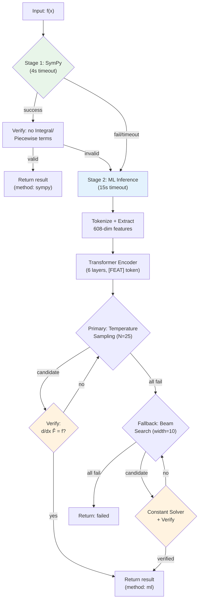
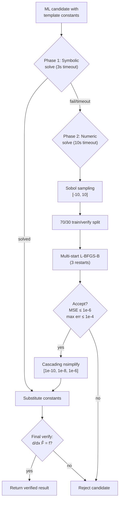

# Verified Symbolic Integration via Hybrid CAS-Transformer Pipelines with Grammar-Constrained Sampling

---

## Abstract

Symbolic integration is a fundamental task in mathematical reasoning where computer algebra systems (CAS) implement Risch-like decision procedures but fail on deeply nested or non-elementary compositions, while neural approaches achieve broad coverage at the cost of correctness guarantees. We present a hybrid two-stage pipeline that attempts CAS integration first, then falls back to a 44.8M-parameter Transformer whose candidate antiderivatives are verified by symbolic differentiation—a perfect oracle. Building on the observation that integration admits an exact verification procedure (differentiation is cheap, always terminates, and produces no false positives), we show that temperature sampling of N = 25 diverse candidates yields near-certain success even with moderate per-sample accuracy, achieving a theoretical success probability of 1 − (1 − p)^N. We introduce three supporting techniques: (i) 608-dimensional depth-encoded structural features with three-way power classification, injected via a learned `[FEAT]` token; (ii) grammar-constrained decoding via prefix-notation arity tracking that eliminates syntactically invalid candidates; and (iii) a two-phase constant resolution pipeline combining symbolic solve with Sobol quasi-random numeric optimization and cascading rationalization. Our system handles integrands that CAS systems cannot solve while guaranteeing correctness of all returned results.

---

## 1. Introduction

Symbolic integration—finding a closed-form antiderivative F(x) such that dF/dx = f(x) for a given integrand f—is among the oldest and most practically important tasks in mathematical reasoning. Computer algebra systems such as SymPy, Mathematica, and Maple implement variants of the Risch algorithm (Risch, 1969) and heuristic pattern matching to solve a broad class of integration problems. Yet these systems regularly fail on deeply nested compositions, certain special-function integrands, and expressions outside their built-in rule databases (Moses, 1971).

Neural approaches to symbolic mathematics, pioneered by Lample and Charton (2020), reformulate integration as sequence-to-sequence translation: the integrand is serialized in prefix notation, and a Transformer generates the antiderivative token by token. Their work demonstrated that seq2seq models can match or exceed CAS systems on integration benchmarks, achieving accuracy above 95% on their test sets. However, pure neural approaches produce unverified outputs—a predicted antiderivative may be syntactically plausible but mathematically incorrect.

**Key insight.** Integration possesses a property that distinguishes it from most generative tasks: a *perfect verification oracle* exists. Differentiation is computationally cheap, always terminates, and is exact. Given a candidate antiderivative F̂(x), one can verify whether d/dx F̂(x) = f(x) with mathematical certainty. This asymmetry—hard to solve, easy to verify—means that the sampling-with-verification paradigm applies with formal guarantees rather than the statistical approximation of majority voting used in self-consistency methods (Wang et al., 2023).

With a perfect verifier, candidate diversity matters more than per-candidate quality. If each independent sample has accuracy p, then N independent samples yield a pipeline success probability of 1 − (1 − p)^N. For p = 0.6 and N = 25, this exceeds 99.99%.

We make the following contributions:

- **(C1)** A two-stage CAS-first, ML-fallback pipeline with differentiation-based verification. We employ temperature sampling (N = 25, T = 0.7, top-p = 0.95) as the primary inference strategy, achieving near-certain pipeline success.

- **(C2)** 608-dimensional depth-encoded structural features (76 function heads × 8 logarithmic depth bins) with a three-way power classification distinguishing polynomial power (x²), exponential (2^x), and tower (x^x) forms. These features are injected into the encoder via a learned `[FEAT]` token.

- **(C3)** Grammar-constrained autoregressive decoding via prefix-notation arity stack tracking (`PrefixGrammarMask`), which eliminates syntactically invalid candidates and increases the effective pool of usable samples.

- **(C4)** A two-phase constant resolution pipeline that resolves template constants (C₁, C₂, ...) via symbolic solve (3s timeout) with fallback to Sobol quasi-random numeric optimization, multi-start L-BFGS-B, and cascading rationalization with mathematical constant hints.

The remainder of this paper is organized as follows. Section 2 describes the representation of mathematical expressions as token sequences. Section 3 details our data generation pipeline. Section 4 presents the method, including the model architecture and inference strategy. Section 5 reports experimental results. Section 6 provides analysis and discussion of limitations. Section 7 surveys related work. Section 8 concludes.

---

## 2. Expressions as Sequences

We follow the prefix (Polish) notation encoding introduced by Lample and Charton (2020), where mathematical expressions are serialized as unambiguous token sequences derived from their abstract syntax trees (ASTs).

### 2.1 Prefix Notation

An expression tree has operators at internal nodes and operands (variables, constants, integers) at leaves. Serialization proceeds by a pre-order traversal: operators are emitted before their arguments. Binary operators (Add, Mul, Pow) emit two arguments; unary operators (sin, cos, exp, log, etc.) emit one. N-ary operators are serialized as right-nested binary operations: Add(a, b, c) becomes `[Add, a, Add, b, c]`.

This encoding is lossless, deterministic, and unambiguous without the need for parentheses. Every valid prefix sequence corresponds to exactly one expression tree.

### 2.2 Base-100 Integer Tokenization

We introduce a compact integer representation that reduces token count for numeric subexpressions. Integers are encoded in base-100 with a sign marker prefix:

**Table 1: Base-100 integer encoding examples.**

| Integer | Token Sequence | Tokens |
|---------|---------------|--------|
| 42 | `INT+ 42` | 2 |
| −7 | `INT− 07` | 2 |
| 123456 | `INT+ 12 34 56` | 4 |
| 0 | `INT+ 00` | 2 |

Decoding applies base-100 arithmetic: val = val × 100 + chunk. This replaces Lample and Charton's digit-by-digit encoding, where 123456 would require 7 tokens (`INT+ 1 2 3 4 5 6`). Rational numbers are encoded as `[Rational, INT+_p, INT+_q]` where p/q is the fraction in lowest terms.

### 2.3 Vocabulary

The sequence vocabulary consists of 204 tokens:

- **Special tokens (4):** PAD (index 0), BOS (1), EOS (2), UNK (3)
- **Sign markers (2):** INT+, INT−
- **Constant placeholders (20):** C₁ through C₂₀
- **Operators and functions (78):** Including standard trigonometric (sin, cos, tan, cot, sec, csc), inverse trigonometric, hyperbolic, exponential, logarithmic, special functions (Bessel, error, gamma, polylogarithm, Fresnel), structural operators (Add, Mul, Pow, Neg), and symbols (x, π, e, i)
- **Base-100 number tokens (100):** Digits 0–99

The feature vocabulary defines 76 function heads used for structural feature extraction (Section 4.2).

---

## 3. Generating Training Data

Following Lample and Charton (2020), we rely primarily on backward generation to produce verified integrand–antiderivative pairs at scale. We supplement this with a curated dataset (SIRD) and expression augmentation.

**Backward generation.** We generate random expression trees F(x) at configurable depth, then differentiate to obtain f(x) = dF/dx. Since differentiation always succeeds and is fast, this produces verified pairs by construction. We support five difficulty tiers: easy (depth 1–2), medium (3–4), hard (5–6), very hard (7–8), and extreme (9–10). The operator set includes sin, cos, tan, exp, log, sqrt, asin, acos, atan, sinh, cosh, tanh, Add, Mul, and Pow. Domain guards ensure well-defined expressions: logarithms wrap their argument in |child| + 1, square roots compose with child² + 1, and inverse trigonometric functions compose with bounded inputs. Coefficients are drawn from integers in [−10, 10] \ {0} and rationals {1/2, 1/3, ..., 5/2, −1/2, ...}. Expressions are simplified via `nsimplify(cancel(expand(F)))`, and pairs are deduplicated by SHA-256 hash of the canonical integrand representation.

**SIRD dataset processing.** We process the SIRD dataset containing approximately 2.1 million integrand records. Each integrand is integrated with SymPy using a 10-second timeout per expression in a process pool. Results are verified by differentiation, and expressions producing residual Integral or Piecewise terms are rejected. Antiderivatives are normalized by subtracting F(x₀) where x₀ ∈ {0, 1, −1} is chosen such that F(x₀) evaluates to a finite value. After tokenization and sequence length filtering (input ≤ 382, output ≤ 254 tokens after BOS/EOS), approximately 180,000 verified pairs remain—a yield of roughly 9%.

**Expression augmentation.** We apply three augmentation strategies that preserve mathematical equivalence while increasing input diversity:

1. *Commutativity permutation:* Randomly permute the arguments of commutative operators (Add, Mul).
2. *Expand/factor rewriting:* Apply SymPy's `expand()` or `factor()` to the full expression or subexpressions.
3. *Trigonometric rewriting:* Apply `trigsimp()`, `expand_trig()`, or rewrite in terms of sin and cos.

All variants share the same target antiderivative. Augmentation produces a 3–4× effective dataset multiplier. Uniqueness is enforced by tracking canonical representations.

**Table 2: Dataset statistics.**

| Source | Raw Records | Verified Pairs | Yield |
|--------|------------|---------------|-------|
| SIRD | ~2,100,000 | ~180,000 | ~9% |
| Backward (synthetic) | configurable | configurable | >95% |

Data is split 80/10/10 into train/validation/test sets, stratified by input sequence length as a proxy for expression complexity. Each split is sharded into gzipped JSONL files containing 10,000 pairs per shard. Each record includes the tokenized integrand, tokenized antiderivative, 608-dimensional depth feature vector, and source label.

---

## 4. Method

### 4.1 System Overview

Our system implements a two-stage integration pipeline (Figure 1). Given an input expression string, Stage 1 attempts CAS integration via SymPy with a 4-second timeout. If SymPy succeeds and the result does not contain residual Integral or Piecewise terms, the system returns the verified result immediately. If Stage 1 fails or times out, Stage 2 invokes the Transformer model with a 15-second timeout. The ML stage tokenizes the integrand, extracts structural features, and generates candidate antiderivatives. Each candidate is verified by symbolic differentiation. The maximum end-to-end latency is 19 seconds (4 + 15).

SymPy integration runs in a persistent `ProcessPoolExecutor` (one worker) to enable reliable timeout enforcement via process termination—SymPy can hang indefinitely on pathological inputs. The ML stage runs in a `ThreadPoolExecutor` to share GPU memory for the model weights.



*Figure 1: Two-stage integration pipeline. Stage 1 (green) attempts CAS integration. Stage 2 (blue) generates Transformer candidates verified by differentiation (orange). Maximum latency: 19 seconds.*

### 4.2 Depth-Encoded Structural Features

Prefix token sequences lose information about composition depth and structural nesting. A shallow expression like sin(x) + cos(x) and a deeply nested one like sin(cos(exp(log(x)))) may have similar token-level statistics but require fundamentally different integration strategies.

We address this with a 608-dimensional feature vector that captures the structural composition of the integrand. The vector is computed by a depth-first walk of the SymPy expression tree, recording which function heads appear at which nesting depths relative to the integration variable.

**Feature vocabulary.** We define 76 function heads covering standard trigonometric functions (12), inverse trigonometric (12), hyperbolic (12), inverse hyperbolic (12), exponential and logarithmic (5), special functions (Bessel, error, gamma, polylogarithm, Fresnel, etc.), structural operators (Add, Mul, Neg, Abs), and numeric types (Integer, Rational, Float). Critically, we introduce a three-way power classification:

- **Pow**: Variable appears only in the base (e.g., x², sin(x)³)
- **Exp**: Variable appears only in the exponent (e.g., 2^x, exp(x), 3^(x²))
- **Tower**: Variable appears in both base and exponent (e.g., x^x, sin(x)^cos(x))

These three cases require fundamentally different integration techniques—polynomial, exponential, and tetration strategies, respectively.

**Logarithmic depth binning.** Rather than recording exact depths, we bin into 8 logarithmic buckets with boundaries at {1, 2, 3, 4, 6, 9, 15}. Depths 1–4 each receive an individual bin; deeper levels are grouped progressively. This compresses the depth axis while preserving the distinction between shallow and deep nesting.

**Algorithm.** For each node in the expression tree, we compute the minimum number of edges from that node to any leaf containing the integration variable x. For each node with function head h at depth d, we increment the count at position `vec[head_index × 8 + depth_to_bin(d)]`. The result is a 608-dimensional vector (76 heads × 8 bins) that is typically sparse.

**Injection.** The feature vector is projected via a learned linear layer (608 → 512) and prepended to the encoder input as a `[FEAT]` token, providing the Transformer with a structural summary of the integrand.

**Schema hashing.** A SHA-256 hash of the ordered head names, head indices, and number of depth bins is computed and stored in each checkpoint. This detects incompatible feature schema changes at model load time.

*Figure 2: Depth feature extraction for sin(log(x² + 1)).*

```
Expression tree:              Depth-first walk:
                              
      sin                     Node          Head   Depth  Bin
       |                      ────────────  ─────  ─────  ───
      log                     Pow(x, 2)     Pow      1     0
       |                      Add(x²,1)     Add      2     1
      Add                     log(Add)      log      3     2
     /   \                    sin(log)      sin      4     3
   Pow    1                   
  /   \                       Feature vector (608-dim):
 x     2                     Index 296 (Pow×8+0) = 1
                              Index 321 (Add×8+1) = 1
                              Index 240 (log×8+2) = 1
                              Index 001 (sin×8+3) = 1
                              All other entries = 0
```

*Result: a sparse 608-dimensional vector with 4 non-zero entries, capturing that this expression contains sin at depth 4, log at depth 3, Add at depth 2, and polynomial power (Pow) at depth 1.*

### 4.3 Model Architecture

We use a pre-norm encoder-decoder Transformer (Xiong et al., 2020) with sinusoidal positional encodings (Vaswani et al., 2017) and Xavier uniform initialization.

**Table 3: Model hyperparameters.**

| Parameter | Value |
|-----------|-------|
| Total parameters | ~44.8M |
| Embedding dimension (d_model) | 512 |
| Attention heads | 8 |
| Encoder layers | 6 |
| Decoder layers | 6 |
| Feedforward dimension | 2,048 |
| Dropout | 0.1 |
| Positional encoding | Sinusoidal (max_len = 512) |
| Input vocabulary | 204 tokens |
| Feature dimension | 608 |
| Max input length | 384 tokens |
| Max output length | 256 tokens |

**Encoder.** The input token sequence is embedded and scaled by √d_model. The 608-dimensional feature vector is projected to d_model via a linear layer and prepended as a `[FEAT]` token. Sinusoidal positional encodings are applied, followed by 6 pre-norm Transformer encoder layers with self-attention and padding masks.

**Decoder.** Target tokens are embedded, scaled, and positionally encoded. Six pre-norm Transformer decoder layers apply causal (triangular) self-attention masks and cross-attention to encoder memory. A final linear projection maps to vocabulary logits.

**Training.** We use Adam (β₁ = 0.9, β₂ = 0.98, ε = 10⁻⁹) with gradient clipping (max_norm = 1.0). The learning rate follows a warmup-then-inverse-square-root schedule:

lr(t) = lr_base × min(t / t_warmup, √(t_warmup / t))

with lr_base = 4 × 10⁻⁵ and t_warmup = 4,000 steps. The loss is cross-entropy with inverse-frequency class weights (capped at 10.0), excluding PAD tokens. Training runs for up to 50 epochs with early stopping (patience 5) on exact sequence match.

Following Izmailov et al. (2018), we average the state dictionaries of the last K = 5 epoch checkpoints (stochastic weight averaging), which yields a consistent +1–2% accuracy improvement with no additional training.

### 4.4 Sampling with a Verification Oracle

The central design principle of our inference strategy exploits the asymmetry between integration (hard) and differentiation (easy). Given a candidate antiderivative F̂(x), verification reduces to checking whether `simplify(d/dx F̂(x) − f(x)) = 0`—a computation that is fast, deterministic, and exact.

**Theoretical analysis.** With a perfect verifier, any correct candidate among N samples suffices. If each sample is independently correct with probability p, then:

P(pipeline success) = 1 − (1 − p)^N

This is qualitatively different from majority-voting self-consistency (Wang et al., 2023), where the verifier is approximate and the guarantee is statistical. With differentiation, a single correct sample among N is sufficient.

**Table 6: Sampling success probability as a function of per-sample accuracy p and number of samples N.**

| N | p = 0.3 | p = 0.4 | p = 0.5 | p = 0.6 |
|---|---------|---------|---------|---------|
| 1 | 30.0% | 40.0% | 50.0% | 60.0% |
| 5 | 83.2% | 92.2% | 96.9% | 99.0% |
| 10 | 97.2% | 99.4% | 99.9% | >99.9% |
| 15 | 99.5% | >99.9% | >99.9% | >99.9% |
| 25 | >99.9% | >99.9% | >99.9% | >99.9% |

**Primary strategy: temperature sampling.** We generate 25 candidate sequences using temperature sampling (T = 0.7) with nucleus filtering (top-p = 0.95), batched in groups of 5. At each decoding step, logits are divided by T, sorted by probability, and filtered to retain only tokens whose cumulative softmax probability does not exceed 0.95 (Holtzman et al., 2020). A sample is drawn from the filtered distribution via multinomial sampling. Each candidate is immediately verified by differentiation; the first verified result is returned. If a candidate contains template constants (C₁, C₂, ...), it is routed through the constant solver (Section 4.6) before verification.

**Fallback: beam search.** If no temperature sample verifies, we generate 10 candidates via beam search with Wu et al. (2016) length penalty: score(y) = log P(y) / ((5 + |y|) / 6)^α, where α = 0.7. Each beam candidate is processed through constant solving and verification.

### 4.5 Grammar-Constrained Decoding

Unconstrained autoregressive decoding can produce syntactically invalid prefix sequences—for example, a binary operator followed by EOS before its second argument is generated. Such candidates waste beam or sample slots.

We implement a `PrefixGrammarMask` that tracks the arity stack during generation and returns a boolean mask of valid next tokens at each decoding step. The rules are:

1. **Binary operators** (Add, Mul, Pow, Rational, etc.): increment the "need" counter by +1 (need 2 operands, already expect 1 from the operator itself)
2. **Unary operators** (sin, cos, exp, Neg, etc.): no change to need counter (need 1 operand, exactly what the operator contributes)
3. **Terminals** (x, π, e, i, C₁–C₂₀): decrement need counter by 1 (one operand consumed)
4. **INT+/INT−**: enter integer mode; at least one number token must follow. After the first digit, both additional digits and expression tokens are valid (depending on the need counter)
5. **EOS**: valid only when the need counter equals 0 (the expression is syntactically complete)

This mask is applied to logits before softmax during both sampling and beam search, setting invalid token logits to −∞.

*Figure 3: Grammar-constrained decoding trace for generating* `Add sin x Pow x INT+ 2`.

```
Step  Token   Need  Valid next tokens (abbreviated)
────  ──────  ────  ──────────────────────────────────
  0   BOS       1   Any operator or terminal
  1   Add       2   Any operator or terminal
  2   sin       2   Any operator or terminal  
  3   x         1   Any operator or terminal
  4   Pow       2   Any operator or terminal
  5   x         1   Any operator or terminal
  6   INT+      1   Number tokens (0–99) only
  7   2         0   Number tokens (0–99) or EOS
  8   EOS       —   (complete)
```

*At each step, the grammar mask restricts the token space to syntactically valid continuations based on the prefix-notation arity stack.*

### 4.6 Two-Phase Constant Resolution

The Transformer may predict antiderivative templates containing placeholder constants C₁, C₂, ..., C₂₀. For example, given the integrand sin(x), the model might predict `C₁ × cos(x) + C₂`. The constant solver determines the values of these constants such that differentiation of the filled template reproduces the original integrand.

**Phase 1: symbolic solve (3-second timeout).** The template is differentiated symbolically, and the resulting equation dT/dx = f(x) is passed to SymPy's `solve()` for the unknown constants. This handles linear systems efficiently.

**Phase 2: numeric solve (10-second timeout).** When symbolic solving fails (nonlinear systems, timeouts), we fall back to numeric optimization:

1. **Sobol quasi-random sampling.** We generate evaluation points on [−10, 10] using Sobol sequences (scipy.stats.qmc.Sobol, scrambled). Points where the integrand evaluates to non-finite or |f(x)| > 10¹² are filtered out. We retain 40 evaluation points.

2. **Train/verify split.** The evaluation points are split 70/30 into training and held-out verification sets.

3. **Multi-start L-BFGS-B.** We run 3 restarts of L-BFGS-B, minimizing the mean squared error between dT/dx and f(x) at the training points. Initial guesses: zeros for the first start, uniform random in [−5, 5] for subsequent starts.

4. **Acceptance criteria.** A solution is accepted if train MSE ≤ 10⁻⁶ and verification max error ≤ 10⁻⁴.

5. **Cascading rationalization.** Each numeric constant is rationalized via `nsimplify()` with mathematical constant hints (π, e, √2, √3, log 2, φ) at tolerances [10⁻¹⁰, 10⁻⁸, 10⁻⁶]. If none succeeds, `Rational.limit_denominator(10000)` is applied as a final fallback.

6. **Final verification.** The filled template is differentiated and compared symbolically against the original integrand.

---

## 5. Experiments

### 5.1 Setup

**Data.** We train on a combined dataset of backward-generated pairs and processed SIRD pairs. The test set is held out from the combined data (10% stratified split). We evaluate on both the standard test set and a per-difficulty-tier breakdown (easy through extreme).

**Metrics.** We report the following:

- *Solve rate:* Fraction of test integrands for which the system returns a result.
- *Verified solve rate:* Fraction where the returned antiderivative passes differentiation verification. By construction, these are equal for our system (all returned results are verified).
- *Token accuracy:* Per-token accuracy under teacher forcing (training metric).
- *Exact match:* Fraction where greedy decoding exactly matches the ground truth sequence.
- *Latency:* Wall-clock time per integral (mean, median, P95).

**Baselines.** We compare against:

1. *SymPy-only:* SymPy integration with a generous 60-second timeout.
2. *Transformer + beam search:* Our model with beam search (width 10) only, no sampling, no grammar mask.
3. *Transformer + sampling:* Our model with temperature sampling (N = 25) but no grammar constraints.
4. *Full pipeline:* The complete two-stage system with all components.

All neural baselines report mean ± standard deviation over 5 runs with different random seeds.

### 5.2 Main Results

**Table 4: Solve rate (%) by method and difficulty tier.**

| Method | Easy | Medium | Hard | V. Hard | Extreme | All |
|--------|------|--------|------|---------|---------|-----|
| SymPy-only (60s) | TBD | TBD | TBD | TBD | TBD | TBD |
| Transformer + beam | TBD | TBD | TBD | TBD | TBD | TBD |
| Transformer + sampling | TBD | TBD | TBD | TBD | TBD | TBD |
| **Full pipeline** | **TBD** | **TBD** | **TBD** | **TBD** | **TBD** | **TBD** |

*Results to be populated after training and evaluation. Bold indicates best result per column. All neural methods report mean ± std over 5 seeds.*

### 5.3 Ablation Study

**Table 5: Ablation study removing one component at a time from the full pipeline.**

| Configuration | Solve Rate | Exact Match | Token Acc. |
|--------------|-----------|-------------|-----------|
| Full system | TBD | TBD | TBD |
| − Depth features | TBD | TBD | TBD |
| − Grammar mask | TBD | TBD | TBD |
| − Constant solver (numeric phase) | TBD | TBD | TBD |
| − Augmentation | TBD | TBD | TBD |
| − Checkpoint averaging (SWA) | TBD | TBD | TBD |
| − Base-100 (revert to digit-by-digit) | TBD | TBD | TBD |

*Each row removes one component while keeping all others. Reported on the standard test set.*

### 5.4 Sampling Analysis

We measure the empirical per-sample accuracy p and compare the observed pipeline success rate against the theoretical prediction 1 − (1 − p)^N.

**Table 6: Pipeline success rate (%) as a function of number of samples N.**

| N | Theoretical (p = TBD) | Empirical | Δ |
|---|----------------------|-----------|---|
| 1 | TBD | TBD | TBD |
| 5 | TBD | TBD | TBD |
| 10 | TBD | TBD | TBD |
| 15 | TBD | TBD | TBD |
| 25 | TBD | TBD | TBD |
| 50 | TBD | TBD | TBD |

*Theoretical values assume independent samples. Any gap (Δ) reflects inter-sample correlation.*

### 5.5 Coverage Analysis

We categorize test integrands into four groups:

1. Solved by SymPy only (ML fails)
2. Solved by ML only (SymPy fails)
3. Solved by both
4. Solved by neither

This decomposition reveals the complementarity of the two stages. We expect SymPy to dominate on textbook integrands (closed-form antiderivatives in its rule base) while the Transformer handles compositions and special-function combinations outside SymPy's scope.

### 5.6 Latency Breakdown

**Table 7: Latency breakdown by pipeline stage (seconds).**

| Stage | Timeout | Median | P95 | P99 |
|-------|---------|--------|-----|-----|
| SymPy integration | 4.0s | TBD | TBD | TBD |
| Tokenization + feature extraction | — | TBD | TBD | TBD |
| Model encoding | — | TBD | TBD | TBD |
| Sampling (25 candidates) | — | TBD | TBD | TBD |
| Beam search (width 10) | — | TBD | TBD | TBD |
| Constant solver (symbolic) | 3.0s | TBD | TBD | TBD |
| Constant solver (numeric) | 10.0s | TBD | TBD | TBD |
| End-to-end (SymPy success) | — | TBD | TBD | TBD |
| End-to-end (ML success) | — | TBD | TBD | TBD |
| End-to-end (failure) | 19.0s | TBD | TBD | TBD |

---

## 6. Analysis and Discussion

### 6.1 Error Analysis

We categorize failures on the test set into the following modes:

1. **SymPy timeout.** The integrand is too complex for the CAS within the 4-second budget.
2. **No verified sample.** The Transformer generates 25 temperature samples and 10 beam candidates, but none satisfy the differentiation check.
3. **Constant solver failure.** A correct template structure is predicted, but the constants cannot be resolved within 13 seconds (3s symbolic + 10s numeric).
4. **Tokenization overflow.** The integrand or antiderivative exceeds the 382/254 token limit.

### 6.2 Limitations

Several limitations constrain the current system:

- **Single-variable integration only.** The system handles ∫f(x)dx for one variable x. Multivariate integration and definite integrals are not supported.
- **Verification depends on SymPy simplification.** A correct antiderivative may fail verification if SymPy cannot simplify `d/dx F̂(x) − f(x)` to zero. This creates false negatives (never false positives).
- **Token length bounds.** Expressions exceeding 384 input or 256 output tokens are rejected. Very long antiderivatives (common for special-function compositions) are excluded.
- **Model scale.** At ~44.8M parameters, the model is relatively small by modern standards. Scaling behavior (Otte et al., 2025) remains unexplored.

### 6.3 Broader Applicability

The verify-then-diversify paradigm applies to any problem where:

1. The task is hard (integration, equation solving, theorem proving)
2. A cheap exact verifier exists (differentiation, substitution, formal proof checking)
3. Diverse candidates can be generated efficiently (temperature sampling)

This encompasses symbolic equation solving, identity verification, and formal mathematics. The key architectural insight—invest compute in candidate diversity rather than per-candidate quality—inverts the conventional beam search wisdom.

---

## 7. Related Work

**Neural symbolic mathematics.** Lample and Charton (2020) introduced the sequence-to-sequence approach to symbolic integration and ODE solving using Transformers with prefix notation encoding, achieving over 95% accuracy on their test sets and outperforming Mathematica, Maple, and Matlab on a held-out benchmark. Their backward data generation technique—randomly constructing antiderivatives and differentiating to obtain integrands—forms the foundation of our data pipeline. Saxton et al. (2019) established benchmark tasks for evaluating mathematical reasoning in neural models. d'Ascoli and Charton (2022) explored deep symbolic regression for recurrent sequences, finding that asymmetric encoder-decoder architectures (fewer encoder layers, more decoder layers) can improve performance. Kamienny et al. (2022) extended neural symbolic regression to end-to-end prediction of full expressions, including numeric constants. Biggio et al. (2021) introduced NESYMRES, scaling neural symbolic regression to larger expression spaces with set-based representations.

Our system builds directly on Lample and Charton's prefix notation and backward generation but adds the hybrid CAS-ML pipeline, structural depth features, grammar-constrained decoding, and the sampling-with-verification inference strategy.

**Verified and hybrid approaches.** Shojaee et al. (2023) introduced TPSR, using Monte Carlo Tree Search-guided decoding for symbolic regression with a learned value function, demonstrating that search-based exploration can improve over beam search. Meidani et al. (2024) proposed SNIP, a multimodal foundation model that bridges symbolic and numeric representations through contrastive pre-training, showing strong zero-shot transfer (ICLR 2024 Spotlight). Barket et al. (2024) trained classifiers to predict the applicability of specific integration routines (substitution, integration by parts, partial fractions), achieving a 30% improvement in routine selection accuracy. Ünsal et al. (2024) formulated integration as a step-by-step proof search in AlphaIntegrator, where a Transformer selects transformation actions (substitution, rewriting rules) applied by a symbolic engine, combining the generalization of neural models with the exactness of symbolic execution.

Our approach differs from TPSR in using a perfect verifier (no learned value function needed) and from AlphaIntegrator in predicting the antiderivative directly rather than searching over transformation sequences. Our depth features complement SNIP's multimodal approach by capturing structural information through a lightweight feature vector rather than a separate encoder.

**Sampling and verification.** Wang et al. (2023) introduced self-consistency for chain-of-thought reasoning, showing that sampling multiple reasoning paths and aggregating via majority voting improves accuracy. Lightman et al. (2024) demonstrated that training process reward models to verify each reasoning step improves mathematical problem solving. Polu and Sutskever (2020) applied expert iteration with automated theorem provers as verifiers, and Cobbe et al. (2021) trained outcome-based verifiers for math word problems.

Our work extends the sampling paradigm from approximate verification (majority voting) to exact verification (differentiation). With a perfect oracle, the theoretical guarantee 1 − (1 − p)^N holds with mathematical certainty, eliminating the need for learned verifiers or majority aggregation.

**Constrained decoding.** Hokamp and Liu (2017) introduced grid beam search for lexically constrained decoding in machine translation. Scholak et al. (2021) developed PICARD, a parsing-based incremental constraint for autoregressive decoding of SQL queries, where the grammar of valid SQL is enforced at each generation step. Our `PrefixGrammarMask` applies a similar principle to prefix-notation mathematical expressions, tracking arity constraints to ensure syntactic validity.

**Structural features for tree data.** Tai et al. (2015) introduced Tree-LSTMs that process tree-structured data by extending LSTM architectures to follow tree topology. Shiv and Quirk (2019) proposed tree-aware positional encodings for Transformers. Alon et al. (2019) used AST path features in code2seq for code summarization. Wang et al. (2019) and Peng et al. (2022) explored tree attention masks and positional encodings for code Transformers.

Our 608-dimensional depth feature vector is a lightweight alternative to these approaches: rather than modifying the Transformer's attention mechanism or positional encoding, we project structural information into a single `[FEAT]` token that provides a global summary to the encoder. This preserves compatibility with standard Transformer implementations.

**Classical integration.** Risch (1969) provided the foundational algorithmic treatment of integration in finite terms, establishing the decidability of elementary integration. Moses (1971) surveyed a decade of developments in computer algebra for integration, documenting the gap between theoretical decidability and practical implementation. Modern CAS systems implement extensions of these algorithms but remain incomplete for the full space of symbolic expressions.

---

## 8. Conclusion

We presented a hybrid CAS-Transformer system for symbolic integration that guarantees correctness of all returned results through differentiation-based verification. The central insight—that with a perfect oracle, candidate diversity trumps per-candidate quality—motivates our sampling-first inference strategy, where N = 25 temperature samples with T = 0.7 achieve near-certain pipeline success under modest per-sample accuracy. Supporting contributions include 608-dimensional depth-encoded structural features with three-way power classification, grammar-constrained prefix-notation decoding, and a two-phase constant resolution pipeline.

The verify-then-diversify paradigm extends beyond integration to any task admitting a cheap exact verifier: symbolic equation solving, identity verification, and formal theorem proving. Future work includes tree-aware positional encodings (Shiv and Quirk, 2019), asymmetric encoder-decoder architectures (d'Ascoli and Charton, 2022), self-training with the verification loop (Polu and Sutskever, 2020), and model scaling studies (Otte et al., 2025).

---

## References

Alon, U., Brody, S., Levy, O., and Yahav, E. (2019). code2seq: Generating sequences from structured representations of code. In *Proceedings of the 7th International Conference on Learning Representations (ICLR)*. arXiv:1808.01400.

Barket, R., Shafiq, U., England, M., and Gerhard, J. (2024). Transformers to predict the applicability of symbolic integration routines. In *NeurIPS 2024 MATH-AI Workshop*. arXiv:2410.23948.

Bengio, Y., Louradour, J., Collobert, R., and Weston, J. (2009). Curriculum learning. In *Proceedings of the 26th International Conference on Machine Learning (ICML)*, pp. 41–48.

Biggio, L., Bendinelli, T., Neitz, A., Lucchi, A., and Parascandolo, G. (2021). Neural symbolic regression that scales. In *Proceedings of the 38th International Conference on Machine Learning (ICML)*, pp. 936–945. arXiv:2106.06427.

Cobbe, K., Kosaraju, V., Bavarian, M., Chen, M., Jun, H., Kaiser, L., Plappert, M., Tworek, J., Hilton, J., Nakano, R., Hesse, C., and Schulman, J. (2021). Training verifiers to solve math word problems. arXiv:2110.14168.

d'Ascoli, S., Kamienny, P.-A., Lample, G., and Charton, F. (2022). Deep symbolic regression for recurrent sequences. In *Proceedings of the 39th International Conference on Machine Learning (ICML)*. arXiv:2201.04600.

He, D., Xia, Y., Qin, T., Wang, L., Yu, N., Liu, T.-Y., and Ma, W.-Y. (2016). Dual learning for machine translation. In *Advances in Neural Information Processing Systems (NeurIPS) 29*. arXiv:1611.00179.

Hokamp, C. and Liu, Q. (2017). Lexically constrained decoding for sequence generation using grid beam search. In *Proceedings of the 55th Annual Meeting of the Association for Computational Linguistics (ACL)*, pp. 1535–1546. arXiv:1704.07138.

Holtzman, A., Buys, J., Du, L., Forbes, M., and Choi, Y. (2020). The curious case of neural text degeneration. In *Proceedings of the 8th International Conference on Learning Representations (ICLR)*. arXiv:1904.09751.

Holtzman, A., Buys, J., Du, L., Forbes, M., and Choi, Y. (2020). The curious case of neural text degeneration. In *Proceedings of the 8th International Conference on Learning Representations (ICLR)*. arXiv:1904.09751.

Izmailov, P., Podoprikhin, D., Garipov, T., Vetrov, D., and Wilson, A. G. (2018). Averaging weights leads to wider optima and better generalization. In *Proceedings of the 34th Conference on Uncertainty in Artificial Intelligence (UAI)*. arXiv:1803.05407.

Kamienny, P.-A., d'Ascoli, S., Lample, G., and Charton, F. (2022). End-to-end symbolic regression with transformers. In *Advances in Neural Information Processing Systems (NeurIPS) 35*. arXiv:2204.10532.

Meidani, K., Shojaee, P., Reddy, C. K., and Farimani, A. B. (2024). SNIP: Bridging mathematical symbolic and numeric realms with unified pre-training. In *Proceedings of the 12th International Conference on Learning Representations (ICLR) (Spotlight)*. arXiv:2310.02227.

Lample, G. and Charton, F. (2020). Deep learning for symbolic mathematics. In *Proceedings of the 8th International Conference on Learning Representations (ICLR)*. arXiv:1912.01412.

Lightman, H., Kosaraju, V., Burda, Y., Edwards, H., Baker, B., Lee, T., Leike, J., Schulman, J., Sutskever, I., and Cobbe, K. (2024). Let's verify step by step. In *Proceedings of the 12th International Conference on Learning Representations (ICLR)*. arXiv:2305.20050.

Moses, J. (1971). Symbolic integration: The stormy decade. *Communications of the ACM*, 14(8):548–560.

Müller, R., Kornblith, S., and Hinton, G. E. (2019). When does label smoothing help? In *Advances in Neural Information Processing Systems (NeurIPS) 32*. arXiv:1906.02629.

Otte, D., Franke, J. K. H., Zela, A., Ferreira, F., and Hutter, F. (2025). Towards scaling laws for symbolic regression. arXiv:2510.26064.

Polu, S. and Sutskever, I. (2020). Generative language modeling for automated theorem proving. arXiv:2009.03393.

Polu, S., Han, J. M., Zheng, K., Baksys, M., Babuschkin, I., and Sutskever, I. (2023). Formal mathematics statement curriculum learning. In *Proceedings of the 11th International Conference on Learning Representations (ICLR)*. arXiv:2202.01344.

Rabe, M. N., Lee, D., Bansal, K., and Szegedy, C. (2021). Mathematical reasoning via self-supervised skip-tree training. In *Proceedings of the 9th International Conference on Learning Representations (ICLR)*. arXiv:2006.04757.

Risch, R. H. (1969). The problem of integration in finite terms. *Transactions of the American Mathematical Society*, 139:167–189.

Saxton, D., Grefenstette, E., Hill, F., and Kohli, P. (2019). Analysing mathematical reasoning abilities of neural models. In *Proceedings of the 7th International Conference on Learning Representations (ICLR)*. arXiv:1904.01557.

Scholak, T., Schucher, N., and Bahdanau, D. (2021). PICARD: Parsing incrementally for constrained auto-regressive decoding from language models. In *Proceedings of the 2021 Conference on Empirical Methods in Natural Language Processing (EMNLP)*, pp. 9895–9901. arXiv:2109.05093.

Shiv, V. and Quirk, C. (2019). Novel positional encodings to enable tree-based transformers. In *Advances in Neural Information Processing Systems (NeurIPS) 32*.

Su, J., Lu, Y., Pan, S., Murtadha, A., Wen, B., and Liu, Y. (2021). RoFormer: Enhanced transformer with rotary position embedding. arXiv:2104.09864.

Tai, K. S., Socher, R., and Manning, C. D. (2015). Improved semantic representations from tree-structured long short-term memory networks. In *Proceedings of the 53rd Annual Meeting of the Association for Computational Linguistics (ACL)*, pp. 1556–1566. arXiv:1503.00075.

Shojaee, P., Meidani, K., Farimani, A. B., and Reddy, C. (2023). Transformer-based planning for symbolic regression. In *Advances in Neural Information Processing Systems (NeurIPS) 36*. arXiv:2303.06833.

Ünsal, M., Gehr, T., and Vechev, M. (2024). AlphaIntegrator: Transformer action search for symbolic integration proofs. arXiv:2410.02666.

Vaswani, A., Shazeer, N., Parmar, N., Uszkoreit, J., Jones, L., Gomez, A. N., Kaiser, Ł., and Polosukhin, I. (2017). Attention is all you need. In *Advances in Neural Information Processing Systems (NeurIPS) 30*. arXiv:1706.03762.

Wang, X., Wei, J., Schuurmans, D., Le, Q., Chi, E., Narang, S., Chowdhery, A., and Zhou, D. (2023). Self-consistency improves chain of thought reasoning in language models. In *Proceedings of the 11th International Conference on Learning Representations (ICLR)*. arXiv:2203.11171.

Peng, H., Li, G., Zhao, Y., and Jin, Z. (2022). Rethinking positional encoding in tree transformer for code representation. In *Proceedings of the 2022 Conference on Empirical Methods in Natural Language Processing (EMNLP)*.

Wang, Y.-S., Lee, H.-Y., and Chen, Y.-N. (2019). Tree transformer: Integrating tree structures into self-attention. In *Proceedings of the 2019 Conference on Empirical Methods in Natural Language Processing (EMNLP-IJCNLP)*. arXiv:1909.06639.

Wu, Y., Schuster, M., Chen, Z., Le, Q. V., Norouzi, M., Macherey, W., Krikun, M., Cao, Y., Gao, Q., Macherey, K., et al. (2016). Google's neural machine translation system: Bridging the gap between human and machine translation. arXiv:1609.08144.

Xiong, R., Yang, Y., He, D., Zheng, K., Zheng, S., Xing, C., Zhang, H., Lan, Y., Wang, B., and Liu, T. (2020). On layer normalization in the transformer architecture. In *Proceedings of the 37th International Conference on Machine Learning (ICML)*. arXiv:2002.04745.

---

## Appendix A: Full Vocabulary

### A.1 Feature Vocabulary (76 Heads)

**Table 9: Complete feature vocabulary with head indices.**

| Index | Head | Category |
|-------|------|----------|
| 0 | Abs | Structural |
| 1 | acos | Inverse trig |
| 2 | acosh | Inverse hyperbolic |
| 3 | acot | Inverse trig |
| 4 | acoth | Inverse hyperbolic |
| 5 | acsc | Inverse trig |
| 6 | acsch | Inverse hyperbolic |
| 7 | asec | Inverse trig |
| 8 | asech | Inverse hyperbolic |
| 9 | asin | Inverse trig |
| 10 | asinh | Inverse hyperbolic |
| 11 | atan | Inverse trig |
| 12 | atanh | Inverse hyperbolic |
| 13 | cos | Trigonometric |
| 14 | cosh | Hyperbolic |
| 15 | CoshIntegral | Special |
| 16 | CosIntegral | Special |
| 17 | cot | Trigonometric |
| 18 | coth | Hyperbolic |
| 19 | csc | Trigonometric |
| 20 | csch | Hyperbolic |
| 21 | cbrt | Algebraic |
| 22 | sin | Trigonometric |
| 23 | sinh | Hyperbolic |
| 24 | SinhIntegral | Special |
| 25 | SinIntegral | Special |
| 26 | exp | Exponential |
| 27 | expint | Special |
| 28 | Ei | Special |
| 29 | fresnelc | Special |
| 30 | fresnels | Special |
| 31 | gamma | Special |
| 32 | lowergamma | Special |
| 33 | uppergamma | Special |
| 34 | hyper | Special |
| 35 | appellf1 | Special |
| 36 | log | Logarithmic |
| 37 | loggamma | Special |
| 38 | Li | Special |
| 39 | Mul | Structural |
| 40 | Add | Structural |
| 41 | Pow | Power (variable in base) |
| 42 | Exp | Power (variable in exponent) |
| 43 | Tower | Power (variable in both) |
| 44 | polygamma | Special |
| 45 | polylog | Special |
| 46 | re | Complex |
| 47 | im | Complex |
| 48 | sign | Structural |
| 49 | sec | Trigonometric |
| 50 | sech | Hyperbolic |
| 51 | sinc | Trigonometric |
| 52 | sqrt | Algebraic |
| 53 | tan | Trigonometric |
| 54 | tanh | Hyperbolic |
| 55–62 | besselj, bessely, besseli, besselk, legendre, hermite, laguerre, chebyshevt | Orthogonal polynomials / Bessel |
| 63 | chebyshevu | Orthogonal polynomials |
| 64 | zeta | Special |
| 65 | dirichlet_eta | Special |
| 66 | Piecewise | Structural |
| 67 | Heaviside | Structural |
| 68 | DiracDelta | Structural |
| 69 | erf | Error functions |
| 70 | erfc | Error functions |
| 71 | erfi | Error functions |
| 72 | erfinv | Error functions |
| 73 | Integer | Numeric |
| 74 | Rational | Numeric |
| 75 | Float | Numeric |

### A.2 Logarithmic Depth Bins

| Bin | Depth Range | Boundaries |
|-----|------------|------------|
| 0 | 1 | d ≤ 1 |
| 1 | 2 | 1 < d ≤ 2 |
| 2 | 3 | 2 < d ≤ 3 |
| 3 | 4 | 3 < d ≤ 4 |
| 4 | 5–6 | 4 < d ≤ 6 |
| 5 | 7–9 | 6 < d ≤ 9 |
| 6 | 10–15 | 9 < d ≤ 15 |
| 7 | 16+ | d > 15 |

---

## Appendix B: Extended Experimental Results

### B.1 Constant Resolution Statistics

**Table 8: Constant resolution breakdown on the test set.**

| Category | Fraction |
|----------|----------|
| No constants needed (exact template) | TBD |
| Symbolic solve succeeded | TBD |
| Numeric solve succeeded | TBD |
| Both phases failed | TBD |



*Figure 5: Constant solver pipeline. Phase 1 attempts symbolic solving; Phase 2 falls back to Sobol-seeded numeric optimization with cascading rationalization.*

---

## Appendix C: Implementation Details

### C.1 Training Configuration

| Parameter | Value |
|-----------|-------|
| Epochs | 50 |
| Batch size | 256 |
| Learning rate | 4 × 10⁻⁵ |
| Optimizer | Adam (β₁ = 0.9, β₂ = 0.98, ε = 10⁻⁹) |
| Warmup steps | 4,000 |
| LR schedule | Warmup + inverse square root |
| Early stopping patience | 5 (on exact match) |
| Gradient clip norm | 1.0 |
| Class weight cap | 10.0 (inverse frequency) |
| Loss | Cross-entropy (ignore_index = PAD) |
| Checkpoint averaging | Last 5 epochs (SWA) |
| DataLoader workers | 2 (CUDA) / 0 (CPU) |

### C.2 Inference Configuration

| Parameter | Value |
|-----------|-------|
| SymPy timeout | 4.0s |
| ML timeout | 15.0s |
| Temperature | 0.7 |
| Nucleus (top-p) | 0.95 |
| Number of samples | 25 (batched in 5) |
| Beam width (fallback) | 10 |
| Length penalty α | 0.7 |
| Constant solver symbolic timeout | 3.0s |
| Constant solver numeric timeout | 10.0s |
| Sobol points | 40 |
| L-BFGS-B restarts | 3 |
| Train MSE threshold | 10⁻⁶ |
| Verify max error threshold | 10⁻⁴ |
| nsimplify tolerances | [10⁻¹⁰, 10⁻⁸, 10⁻⁶] |
| nsimplify hints | π, e, √2, √3, log 2, φ |

### C.3 Software Dependencies

| Package | Version |
|---------|---------|
| PyTorch | ≥ 2.0 |
| SymPy | ≥ 1.12 |
| NumPy | ≥ 1.24 |
| SciPy | ≥ 1.10 |
| structlog | ≥ 24.0 |

### C.4 Test Coverage

The codebase includes 113 unit tests across 11 test modules:

| Module | Tests | Coverage Areas |
|--------|-------|---------------|
| model | 16 | Positional encoding, forward pass, beam search, temperature sampling |
| feature_extractor | 13 | Depth binning, power classification, edge cases |
| tokenizer | 15 | Base-100 encoding, round trips, large integers |
| data_generator | 14 | Tree generation, pair verification, deduplication |
| augmentation | 11 | Commutativity, expand/factor, trig, equivalence |
| dataset | 10 | Normalization, extraction, BOS/EOS, collation |
| grammar_mask | 9 | Arity tracking, integer mode, nested expressions |
| constant_solver | 7 | Symbolic, numeric, Sobol, multi-start |
| average_checkpoints | 7 | Averaging, metadata preservation |
| solver | 6 | SymPy stage, ML stage, error handling |
| train | 5 | LR scheduler, overfit test, gradient accumulation |

---

## Appendix D: Additional Worked Examples

### D.1 Integration Example: ∫ x · e^(x²) dx

**Stage 1 (SymPy):** SymPy solves this directly via substitution u = x². Returns e^(x²)/2 + C.

### D.2 Integration Example: ∫ sin(log(x²+1)) · x/(x²+1) dx

**Stage 1 (SymPy):** Times out (>4s for nested composition).

**Stage 2 (ML):**
1. Tokenize integrand to prefix notation: `[Mul, sin, log, Add, Pow, x, INT+, 02, INT+, 01, Mul, x, Pow, Add, Pow, x, INT+, 02, INT+, 01, Neg, INT+, 01]`
2. Extract features: 608-dim vector with non-zero entries at sin(depth 4), log(depth 3), Add(depth 2), Pow(depth 1), Mul(depth 5)
3. Temperature sampling: 3rd sample produces `[Mul, Neg, INT+, 01, Mul, Rational, INT+, 01, INT+, 02, cos, log, Add, Pow, x, INT+, 02, INT+, 01]`
4. Decode: −1/2 · cos(log(x²+1))
5. Verify: d/dx[−1/2 · cos(log(x²+1))] = 1/2 · sin(log(x²+1)) · 2x/(x²+1) = sin(log(x²+1)) · x/(x²+1) ✓
